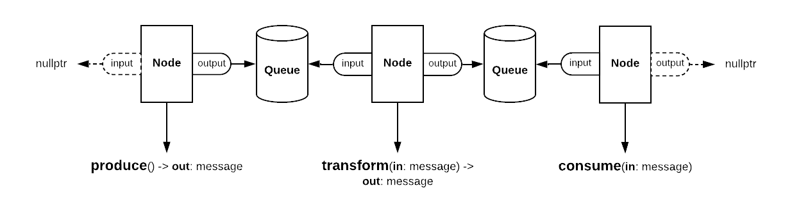

     PIP    E       R
    [PIPelinE manageR]

## Features

The key feature of this library is to define a messaging pipeline between nodes, with queues
in between nodes. Each node can have an input queue and an output queue. If the input queue is
empty the node will sleep (and be awoken by that queue whenever new elements are added).
If the output queue is full the node will also sleep (and be awoken by that queue whenever it
frees up elements).

Sleeping and waking up is done by condition variables and ensures no CPU usage is wasted in
case nodes cannot continue processing.

Hooking up multiple nodes to the same input will create parallel workers, they can share the
messages from their input queue, or all process the same messages. (see `example2.cpp`)

## Architecture



The fact that the first node only has an output makes it a producer.

The fact that the second node has both makes it a transformer.

The fact that the third node has only an input makes it a consumer.

See `node::run()` for the core logic.

Queues have a `push()` and `pop()` and in these operations is checked whether attached
nodes need to be woken up. (Nodes sleep using condition variables controlled by the queue)

The `pipeline_system` class starts all threads after wiring of the pipeline is complete.
It will also collect metrics about the pipeline and supports visualizing the state of
the individual parts.

## Example

For more examples see source directory, this is a simple pipeline that will estimate Pi.
It simulates having to do computing work with a 100 milliseconds sleep.

```c++
#include "piper.h"

#include <iostream>
#include <random>

struct random_xy : public message_type {
  double x;
  double y;
  random_xy(double x, double y) : x(x), y(y) {}
};

struct in_circle : public message_type {
  bool value;
  explicit in_circle(bool value) : value(value) {}
};

int main() {
  pipeline_system system;

  auto points = system.create_queue(5);
  auto results = system.create_queue(5);

  // produce endless stream of random X,Y coordinates.
  system.spawn_producer(
      [&]() -> auto {
        static std::mt19937 gen;
        auto x = (gen() / double(gen.max()));
        auto y = (gen() / double(gen.max()));
        return std::make_shared<random_xy>(x, y);
      },
      points);

  // check if these points are within a circle
  system.spawn_transformer<random_xy>(
      [](auto point) -> auto {
        std::this_thread::sleep_for(std::chrono::milliseconds(100));
        auto dist = sqrt(pow(point->x - 0.5, 2) + pow(point->y - 0.5, 2));
        return std::make_shared<in_circle>(dist <= 0.5);
      },
      points,
      results);

  // estimate pi based on results
  system.spawn_consumer<in_circle>(
      [](auto result) {
        static size_t nom = 0, denom = 0;
        if (result->value) nom++;
        denom++;
        a(std::cout) << "Estimated pi: " << 4 * (nom / (double)denom) << std::endl;
      },
      results);

  system.start();
}
```

## Building

```bash
make         # build all
make debug   # debug build all
make format  # format source code with clang-format
```

## Running

```bash
./build/example
./build/example2
```

## Usage in projects

First add as submodule:

```bash
git submodule add https://github.com/rayburgemeestre/piper libs/piper
```

Then add path in your `CMakeLists.txt`

    include_directories("${CMAKE_CURRENT_SOURCE_DIR}/libs/piper/include/")

Optionally add the source code directly to your own project, for example:

    file(GLOB_RECURSE program_SOURCES << existing stuff >> "src/libs/piper/src/*")
    add_executable(program ${program_SOURCES})
    
Optionally link against the library (after building it):

    target_link_libraries(program libs/piper/libpiper.a)

Start by including `piper.h`, and see examples for usage.

